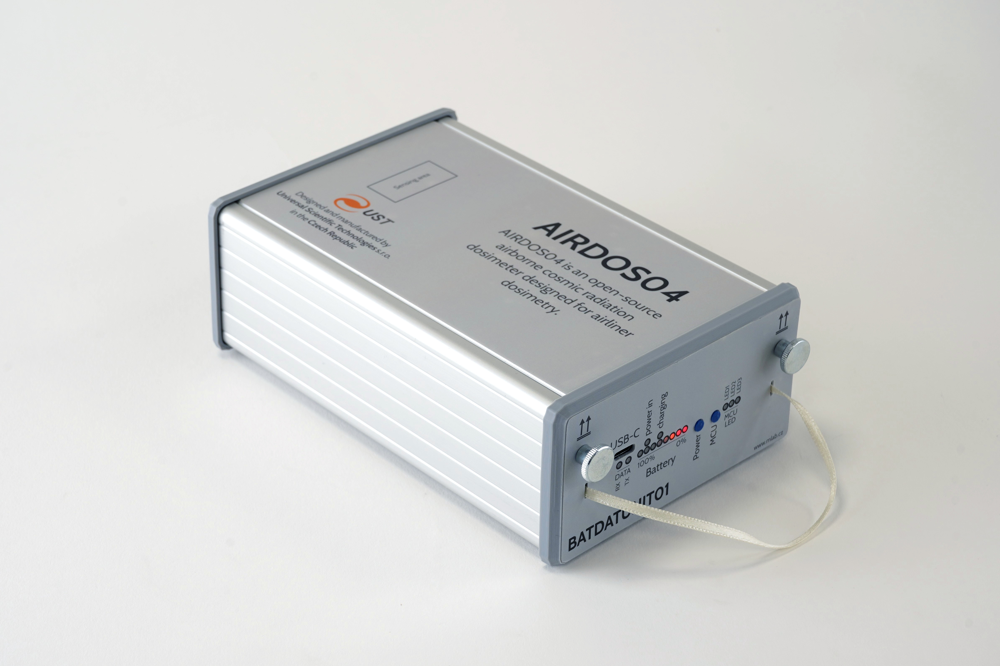
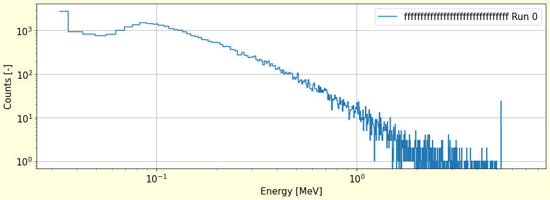
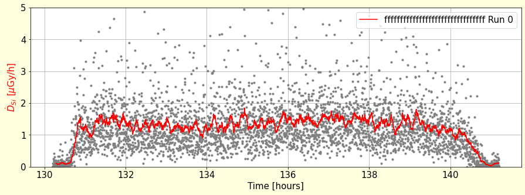

# AIRDOS04 - Specialized Cosmic Radiation Dosimeter for Airliners

The upgraded version of [AIRDOS02](https://github.com/UniversalScientificTechnologies/AIRDOS02) airborne detector. The instrument is designed primarily for the dosimetry of cabin crew and flight attendants of commercial flights. A detailed description of the use is in the [user manual](https://docs.dos.ust.cz/airdos/AIRDOS04).

## Where to get it?

AIRDOS04 is commercially available from [Universal Scientific Technologies s.r.o.](https://www.ust.cz/), write an email to sale@ust.cz.
The device is designed as open-source hardware and software and is released under the GPLv3 license. The device was initially developed and maintained by [UST (Universal Scientific Technologies s.r.o.)](https://www.ust.cz) company, which sells it commercially and offers technical support.

## Technical parameters

  * Silicon PIN diode detector with at least 44 mm³ detection volume
  * The effective number of energy channels is 470 ±3
  * Deposited energy ranges from 60 keV to 7 MeV
  * Energy measurement resolution 15 ±2 keV
  * Service interface:  USB-C connector (charging and data download)
  * Optional GPS interface (with revised BATDATUNIT01)
  * Energy source: 18650 Li-ion cells conforms with [≤ 100 Wh / 2g restrictions](https://www.iata.org/contentassets/6fea26dd84d24b26a7a1fd5788561d6e/passenger-lithium-battery.pdf)
  * Radiation spectra integration time 10 s
  * Maintenance interval (data download, battery recharge)  30 days
  * Maintenance duration under 5 minutes
  * Approx size LxWxH 166 mm x 107 mm x 57 mm (two  of these should fit to Aircraft printed manual bay)
  * Weight is 0.88 kg (With five accumulator cells in [BATDATUNIT01](https://github.com/mlab-modules/BATDATUNIT01))
  * Environmental operational conditions
    * Device protection: IP30 rating (fully assembled)
    * Operation temperature range: 0°C to 50°C (32°F to 122°F)
    * Operation humidity conditions: non-condensing, 20% to 80% RH

## Example data

## The detailed documentation of the used Hardware components

  * [BATDATUNIT01](https://github.com/mlab-modules/BATDATUNIT01)
  * [BATDATSOCKET01](https://github.com/mlab-modules/BATDATSOCKET01)
  * [USTSIPIN03](https://github.com/ust-modules/USTSIPIN03)
